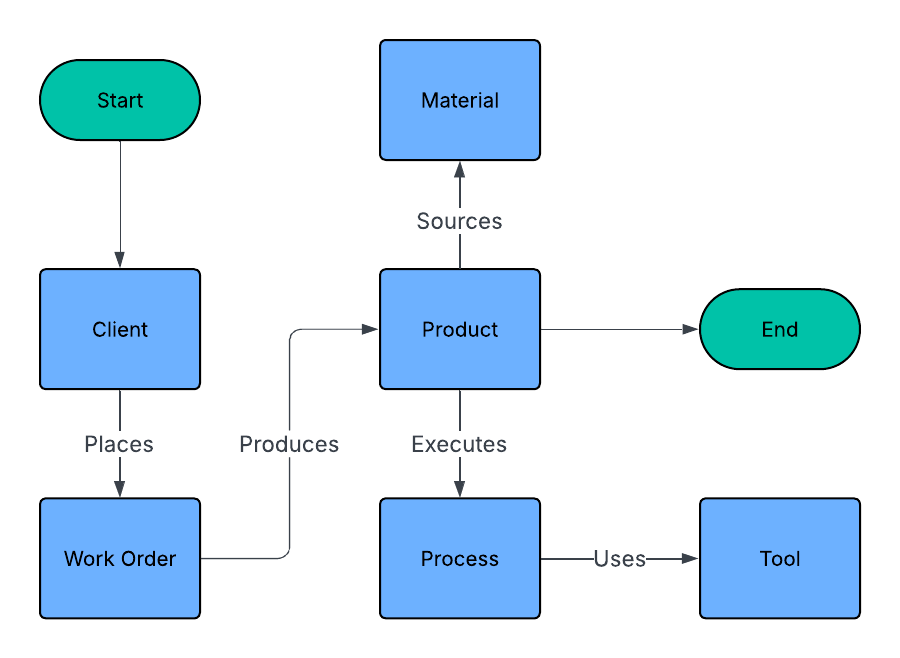
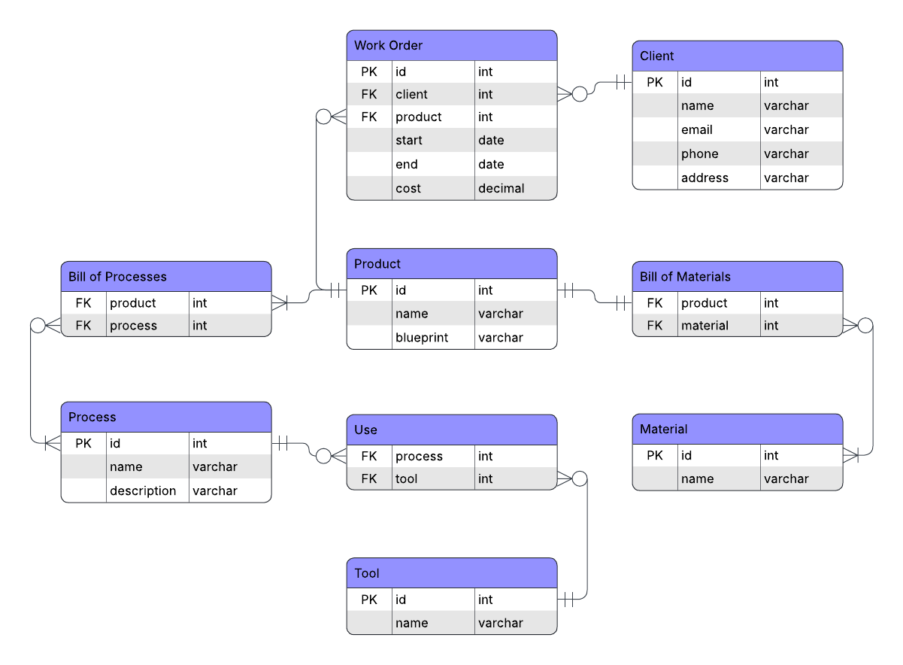
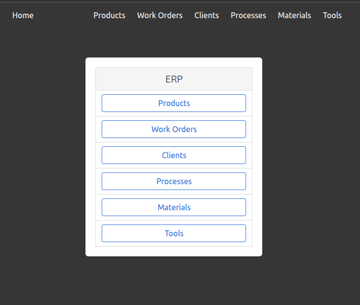
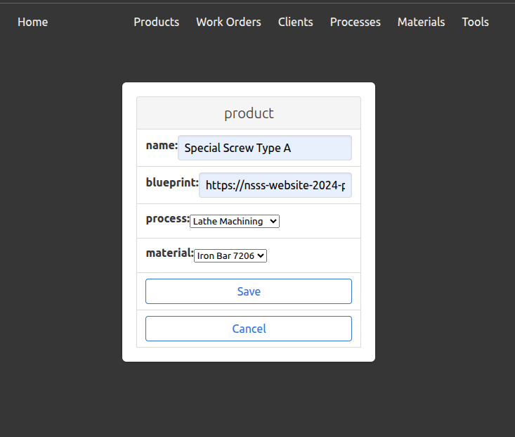
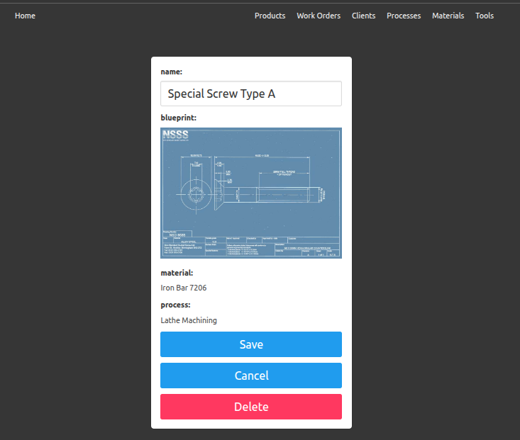
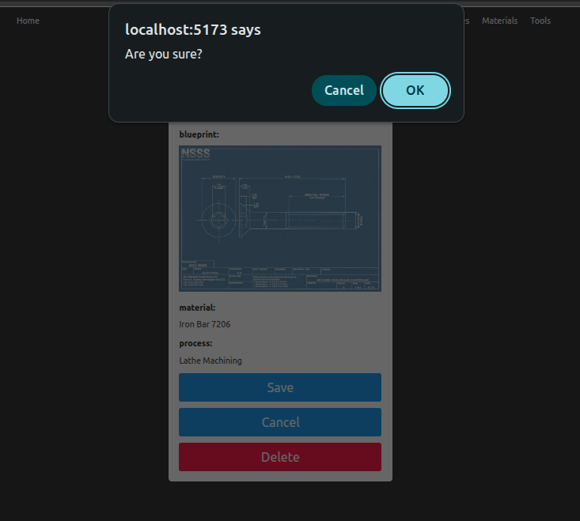
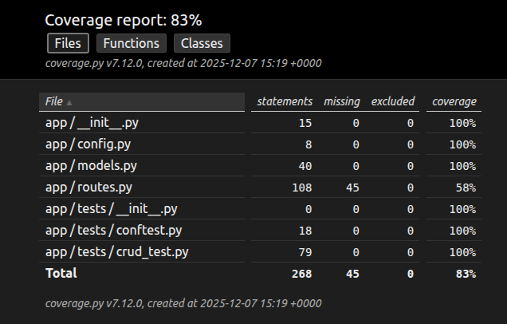

# Industrial ERP Information System

**Dublin Business School**  
**MSc in Information Systems with Computing**  
**Programming for Information Systems - B9IS123**  
**Year 1, Semester 1**  
**Continuous Assessment 2**

**Lecturer name:** Paul Laird

**Student Name:** Mateus Fonseca Campos  
**Student Number:** 20095949  
**Student Email:** 20095949@mydbs.ie

**Submission date:** 14 December 2025

This repository contains an "Industrial ERP Information System" Flask + React web application developed for my Programming for Information Systems CA 2 at Dublin Business School - MSc in Information Systems with Computing, Year 1, Semester 1.

## Part 1: Background

The goal of this assignment was to implement a basic information system for a real small company. The main aspects of the implementation can be divided into three parts:

1. Backend: to deliver a working set of server-side CRUD (Create, Read, Update and Delete) operations.
2. Frontend: to deliver a working set of client-side API-based operations for data exchange between client and server.
3. Deployment: to deploy the implemented application to a cloud environment.

With the above background in mind, the information system developed for this project is an Enterprise Resource Planning (ERP). An ERP is a modular software that allows organizations to manage the different aspects of the business in an integrated environment. ERP modules often include finance, accounting, human resources (HR), supply chain, and customer relationship management (CRM), manufacturing, and more. ERP modules are, normally, connected to a centralized database, which enhances data integrity and consistency across devices.

While traditional ERPs were deployed on premises, modern solutions are mostly cloud-based and implement the Software-as-a-Service (SaaS) delivery model. Cloud ERPs reduce maintenance costs by removing the need to manage on-premise infrastructure and allow for seamless feature updates, with little to no impact to business operations, by employing rolling release strategies, and Continuous Integration and Continuous Delivery (CI/CD) pipelines.

For this project, the focus was on the manufacturing operations module of a, potentially, larger ERP system.

## Part 2: System Requirements and Design

The following flowchart presents an overview of the core manufacturing operations:

|  |
| :-: |
| *Manufacturing operations* |

The following image shows an ER diagram for the previously considered scenario. Cardinality is expressed using Crow’s Foot notation:

|  |
| :-: |
| *ER diagram* |

Based on the requirements gathered and the assignments instructions, the following implementation plan was devised:

1. Backend:
    - Goal: develop a server-side application to act as a Web API.
    - Language: Python.
    - Framework: Flask.
    - Database: SQLite.
    - ORM: SQLAlchemy.
        - Wrapper: Flask-SQLAlchemy.
    - Migration: Alembic.
        - Wrapper: Flask-Migrate.
    - Remarks: traditionally, a Flask application would be developed following the Model-View-Controller (MVC) architectural pattern, where models are runtime object representations of database entities, views are dynamically rendered HTML responses based on templates, and controllers are intermediary routes that direct client requests to server responses via URL endpoints. However, modern web development has moved away from MVC and towards Web APIs. It is worth noting that, while views have been removed, models and controllers are still in use. Instead of serving HTML files, the controllers serve data in JSON form, as a response to requests made to a specific endpoint.
2. Frontend:
    - Goal: develop a client-side application that updates its components via requests made to the Web API.
    - Language: JavaScript.
    - Library: React.
    - CSS framework: Bulma.
    - Build tool: Vite.
3. Deployment:
    - Goal: deploy the entire application (server side and client side) to a remote web server to make the system cloud based.
    - Provider: Amazon Web Services (AWS).
    - Resource: Elastic Compute Cloud (EC2).
    - WSGI-HTTP Server: Gunicorn.
    - HTTP proxy server: Nginx.
    - Remarks: while the web server has been configured to work on both ports 80 (HTTP) and 443 (HTTPS), HTTPS requests will not be met since no SSL certificates were added (traffic encryption and cybersecurity are outside of the scope of this assignment).

## Part 3: Setup

In order to replicate this project, follow the steps below:

1. Create an AWS account.
2. Start an EC2 instance:
    - choose Ubuntu as the OS.
    - save the SSH key locally.
    - define the security rules as:
        - Port 22 &rarr; SSH &rarr; 0.0.0.0/0.
        - Port 80 &rarr; HTTP &rarr; 0.0.0.0/0.
        - Port 443 &rarr; HTTPS &rarr; 0.0.0.0/0.
3. Connect to the server over SSH.
4. Clone this repository:
```
git clone https://github.com/20095949-mateus-campos/programming-ca2.git
```
5. Check that Python 3.10+ is installed:
```
python3 --version
```
6. Install Node.js 24.11+:
```
curl -o- https://raw.githubusercontent.com/nvm-sh/nvm/v0.39.3/install.sh | bash && \
source ~/.bashrc && \
nvm install v24.11.1
```
7. Check that Node.js 24.11+ was installed:
```
node --version
```
8. Change into the project's root directory, start it and build it:
```
cd programming-ca2 && \
npm install && \
npm build
```
9. Change into the api subdirectory, create a virtual environment and activate it:
```
cd api && \
python3 -m venv .venv && \
source .venv/bin/activate
```
10. Install all the project's dependencies:
```
pip install -r requirements.txt
```
11. Initiate, migrate and upgrade the SQLite database:
```
flask db init && \
flask db migrate && \
flask db upgrade
```
12. Leave the virtual environment and change back to the project's root directory:
```
deactivate && \
cd ..
```
13. Install Nginx:
```
sudo apt-get install nginx -y
```
14. Set the Nginx configuration files:
```
sudo rm /etc/nginx/sites-enabled/default && \
sudo cp server/programming-ca2.nginx /etc/nginx/sites-available/programming-ca2.nginx && \
sudo ln -s /etc/nginx/sites-available/programming-ca2.nginx /etc/nginx/sites-enabled/programming-ca2.nginx && \
sudo sed -i 's/www-data/ubuntu/' /etc/nginx/nginx.conf
```
15. Set the Gunicorn service:
```
sudo cp server/programming-ca2.service /etc/systemd/system/programming-ca2.service
```
16. Reload system daemons, start Gunicorn service and reload Nginx service:
```
sudo systemctl daemon-reload && \
sudo systemctl start programming-ca2 && \
sudo systemctl reload nginx
```
At this stage, it should be possible to open the application at http://\<replace-with-aws-ec2-ipv4-address\> on a web browser. Note that since no SSL certificates were added to the server, the application cannot be reached over HTTPS. Manually changing the URL to HTTP may be required if the browser defaults to HTTPS (most do).

Alternatively, for convenience, simply run the shell script below, which will execute all the commands above automatically:

```
git clone https://github.com/20095949-mateus-campos/programming-ca2.git && \
cd programming-ca2 && \
bash setup.sh
```

## Part 4: Proof of Concept

Following the plan established in the previous section, a prototype was developed for the manufacturing module of the ERP system under consideration.

The below is a breakdown of the project’s file structure:

```
root
├── api
│   ├── app
│   │   ├── app.db
│   │   ├── app.py
│   │   ├── config.py
│   │   ├── __init__.py
│   │   ├── models.py
│   │   ├── routes.py
│   │   └── tests
│   │       ├── conftest.py
│   │       ├── crud_test.py
│   │       └── __init__.py
│   ├── htmlcov
│   ├── migrations
│   └── requirements.txt
├── index.html
├── package.json
├── README.md
├── src
│   ├── App.css
│   ├── App.jsx
│   ├── components
│   │   ├── Create.jsx
│   │   ├── Dropdown.jsx
│   │   ├── Field.jsx
│   │   ├── Home.jsx
│   │   ├── Navbar.jsx
│   │   └── Read.jsx
│   └── main.jsx
└── vite.config.js
```
The following are some screenshots of the application in use showcasing CRUD operations for the Product entity (other entities are analogous):

|  |  |
| :-: | :-: |
| *Home view* | *Read products* |  

|  |  |
| :-: | :-: |
| *Create product* | *Read product* |  

|  |  |
| :-: | :-: |
| *Update product* | *Delete products* |  

## Part 5: Testing

Pytest was used to test CRUD operations. The Image below shows the coverage percentage as per the Coverage.py Python library:

|  |
| :-: |
| *Test coverage* |

Full report can be accessed [here](http://htmlpreview.github.io/?https://github.com/20095949-mateus-campos/programming-ca2/blob/main/api/htmlcov/index.html).

## Part 6: Technology Stack and External Resources

Below is a table listing the technologies and the external resources used in this assignment:

|Technology Stack|External Resources|
| :-: | :-: |
|Python 3.10.12|Python Docs|
|Flask 3.1.2|Flask Docs|
|React 19.2.0|React Docs|
|Vite 7.2.4|SQLAlchemy Docs|
|SQLite 3.32.2|Flask-SQLAlchemy Docs|
|SQLAlchemy 2.0.44|Flask-Migrate Docs|
|Flask-SQLAlchemy 3.1.1|Nginx Docs|
|Nginx 1.24.0|AWS EC2 Docs|
|AWS EC2 (t3.micro; ami-049442a6cf8319180)|MDN Docs|
|Bulma CSS 0.7.2|W3 Schools|
|Pytest 9.0.1|Mateus Campos’ personal GitHub Repository|
|Flask-Migrate 4.1.0|Miguel Grinberg’s Blog|
|Node.js 24.11.1|Bulma Docs|
|Gunicorn 23.0.0|Pytest Docs|
|Coverage.py 7.12.0|Gunicorn Docs|
||Coverage.py Docs|

## Part 7: References

Below is the list of references used in this assignment:

- **[Python Docs](https://docs.python.org/3.10/)**
    - [5. Data Structures](https://docs.python.org/3.10/tutorial/datastructures.html)
    - [Built-in Exceptions](https://docs.python.org/3.10/library/exceptions.html)
    - [venv — Creation of virtual environments](https://docs.python.org/3.10/library/venv.html)
    - [5. The import system](https://docs.python.org/3.10/reference/import.html)
    - [datetime — Basic date and time types](https://docs.python.org/3.10/library/datetime.html)
    - [9. Classes](https://docs.python.org/3.10/tutorial/classes.html)
    - [8. Errors and Exceptions](https://docs.python.org/3.10/tutorial/errors.html)
    - [json — JSON encoder and decoder](https://docs.python.org/3.10/library/json.html)
    - [http — HTTP modules](https://docs.python.org/3.10/library/http.html)
    - [http.client — HTTP protocol client](https://docs.python.org/3.10/library/http.client.html)
    - [urllib.request — Extensible library for opening URLs](https://docs.python.org/3.10/library/urllib.request.html)
- **[Flask Docs](https://flask.palletsprojects.com/en/stable/)**
    - [Quickstart](https://flask.palletsprojects.com/en/stable/quickstart/)
    - [API](https://flask.palletsprojects.com/en/stable/api/)
    - [Handling Application Errors](https://flask.palletsprojects.com/en/stable/errorhandling/)
    - [Using SQLite 3 with Flask](https://flask.palletsprojects.com/en/stable/patterns/sqlite3/)
    - [Testing Flask Applications](https://flask.palletsprojects.com/en/stable/testing/)
    - [Application Factories](https://flask.palletsprojects.com/en/stable/patterns/appfactories/)
    - [Define and Access the Database](https://flask.palletsprojects.com/en/stable/tutorial/database/)
    - [Configuration Handling](https://flask.palletsprojects.com/en/stable/config/)
    - [Deploying](https://flask.palletsprojects.com/en/stable/deploying/)
- **[React Docs](https://react.dev/)**
    - [\<form\>](https://react.dev/reference/react-dom/components/form)
    - ['use server'](https://react.dev/reference/rsc/use-server)
    - [Server Components](https://react.dev/reference/rsc/server-components)
    - [Passing Props to a Component](https://react.dev/learn/passing-props-to-a-component)
    - [Catching rendering errors with an Error Boundary ](https://react.dev/reference/react/Component#catching-rendering-errors-with-an-error-boundary)
    - [useEffect](https://react.dev/reference/react/useEffect)
    - [Responding to Events](https://react.dev/learn/responding-to-events)
    - [React calls Components and Hooks](https://react.dev/reference/rules/react-calls-components-and-hooks)
    - [useState](https://react.dev/reference/react/useState)
    - [\<input\>](https://react.dev/reference/react-dom/components/input)
    - [Preserving and Resetting State](https://react.dev/learn/preserving-and-resetting-state)
    - [useMemo](https://react.dev/reference/react/useMemo)
    - [useReducer](https://react.dev/reference/react/useReducer)
    - [You Might Not Need an Effect](https://react.dev/learn/you-might-not-need-an-effect)
    - [Rendering Lists](https://react.dev/learn/rendering-lists)
- **[SQLAlchemy Docs](https://docs.sqlalchemy.org/en/20/)**
    - [ORM Mapped Class Configuration](https://docs.sqlalchemy.org/en/20/orm/mapper_config.html)
    - [Class Mapping API](https://docs.sqlalchemy.org/en/20/orm/mapping_api.html)
    - [Defining Constraints and Indexes](https://docs.sqlalchemy.org/en/20/core/constraints.html)
    - [Column INSERT/UPDATE Defaults](https://docs.sqlalchemy.org/en/20/core/defaults.html)
    - [Data Manipulation with the ORM](https://docs.sqlalchemy.org/en/20/tutorial/orm_data_manipulation.html)
    - [Describing Databases with MetaData](https://docs.sqlalchemy.org/en/20/core/metadata.html)
- **[Flask-SQLAlchemy Docs](https://flask-sqlalchemy.readthedocs.io/en/stable/)**
    - [Quick Start](https://flask-sqlalchemy.readthedocs.io/en/stable/quickstart/)
    - [API](https://flask-sqlalchemy.readthedocs.io/en/stable/api/)
    - [Models and Tables](https://flask-sqlalchemy.readthedocs.io/en/stable/models/)
    - [Advanced Customization](https://flask-sqlalchemy.readthedocs.io/en/stable/customizing/)
    - [Modifying and Querying Data](https://flask-sqlalchemy.readthedocs.io/en/stable/queries/)
    - [Flask Application Context](https://flask-sqlalchemy.readthedocs.io/en/stable/contexts/)
    - [Configuration](https://flask-sqlalchemy.readthedocs.io/en/stable/config/)
- **[Flask-Migrate Docs](https://flask-migrate.readthedocs.io/en/latest/)**
- **[Nginx Docs](https://nginx.org/en/docs/index.html)**
    - [Beginner’s Guide](https://nginx.org/en/docs/beginners_guide.html)
    - [Configuring HTTPS servers](https://nginx.org/en/docs/http/configuring_https_servers.html)
- **[AWS Docs](https://docs.aws.amazon.com/)**
    - [Key pairs](https://docs.aws.amazon.com/AWSEC2/latest/UserGuide/ec2-key-pairs.html)
    - [Security groups](https://docs.aws.amazon.com/vpc/latest/userguide/vpc-security-groups.html)
    - [EC2](https://docs.aws.amazon.com/AWSEC2/latest/UserGuide/concepts.html)
- **[MDN Web Docs](https://developer.mozilla.org/en-US/)**
    - [Using the Fetch API](https://developer.mozilla.org/en-US/docs/Web/API/Fetch_API/Using_Fetch)
    - [Default parameters](https://developer.mozilla.org/en-US/docs/Web/JavaScript/Reference/Functions/Default_parameters)
    - [\<a\>: The Anchor element](https://developer.mozilla.org/en-US/docs/Web/HTML/Reference/Elements/a)
    - [Array.isArray()](https://developer.mozilla.org/en-US/docs/Web/JavaScript/Reference/Global_Objects/Array/isArray)
    - [FormData: get() method](https://developer.mozilla.org/en-US/docs/Web/API/FormData/get)
    - [FormData: getAll() method](https://developer.mozilla.org/en-US/docs/Web/API/FormData/getAll)
    - [FormData: values() method](https://developer.mozilla.org/en-US/docs/Web/API/FormData/values)
    - [415 Unsupported Media Type](https://developer.mozilla.org/en-US/docs/Web/HTTP/Reference/Status/415)
    - [Event: target property](https://developer.mozilla.org/en-US/docs/Web/API/Event/target)
    - [FormData: keys() method](https://developer.mozilla.org/en-US/docs/Web/API/FormData/keys)
    - [FormData: FormData() constructor](https://developer.mozilla.org/en-US/docs/Web/API/FormData/FormData)
    - [Element: replaceWith() method](https://developer.mozilla.org/en-US/docs/Web/API/Element/replaceWith)
    - [max-width](https://developer.mozilla.org/en-US/docs/Web/CSS/Reference/Properties/max-width)
    - [Viewport concepts](https://developer.mozilla.org/en-US/docs/Web/CSS/Guides/CSSOM_view/Viewport_concepts)
    - [\<input type="file"\>](https://developer.mozilla.org/en-US/docs/Web/HTML/Reference/Elements/input/file)
    - [\<label\>: The Label element](https://developer.mozilla.org/en-US/docs/Web/HTML/Reference/Elements/label)
    - [Spread syntax (...)](https://developer.mozilla.org/en-US/docs/Web/JavaScript/Reference/Operators/Spread_syntax)
    - [Element: classList property](https://developer.mozilla.org/en-US/docs/Web/API/Element/classList)
    - [TypeError: can't define property "x": "obj" is not extensible](https://developer.mozilla.org/en-US/docs/Web/JavaScript/Reference/Errors/Cant_define_property_object_not_extensible)
    - [export](https://developer.mozilla.org/en-US/docs/Web/JavaScript/Reference/Statements/export)
    - [Media types (MIME types)](https://developer.mozilla.org/en-US/docs/Web/HTTP/Guides/MIME_types)
    - [Fetch API](https://developer.mozilla.org/en-US/docs/Web/API/Fetch_API)
- **[W3Schools Online Web Tutorials](https://www.w3schools.com/)**
    - [Python any() Function](https://www.w3schools.com/python/ref_func_any.asp)
    - [React Submit Forms](https://www.w3schools.com/react/react_forms_submit.asp)
    - [React Render HTML](https://www.w3schools.com/react/react_render.asp)
    - [React Components](https://www.w3schools.com/react/react_components.asp)
    - [CSS Horizontal Navigation Bar](https://www.w3schools.com/css/css_navbar_horizontal.asp)
    - [Styling React Using CSS](https://www.w3schools.com/react/react_css.asp)
    - [React Props](https://www.w3schools.com/react/react_props.asp)
    - [Python map() Function](https://www.w3schools.com/python/ref_func_map.asp)
    - [Python String join() Method](https://www.w3schools.com/python/ref_string_join.asp)
    - [Python Requests Module](https://www.w3schools.com/python/module_requests.asp)
    - [target Event Property](https://www.w3schools.com/jsref/event_target.asp)
    - [Python filter() Function](https://www.w3schools.com/python/ref_func_filter.asp)
    - [HTML \<button\> type Attribute](https://www.w3schools.com/tags/att_button_type.asp)
    - [JavaScript Popup Boxes](https://www.w3schools.com/js/js_popup.asp)
    - [HTML \<select\> Tag](https://www.w3schools.com/tags/tag_select.asp)
    - [Python Try Except](https://www.w3schools.com/python/python_try_except.asp)
    - [Python assert Keyword](https://www.w3schools.com/python/ref_keyword_assert.asp)
    - [Python Sets](https://www.w3schools.com/python/python_sets.asp)
- **[Mateus Campos' GitHub](https://github.com/mateusfonseca)**
    - [mobileApp2_Accelerometer_Leaderboard](https://github.com/mateusfonseca/mobileApp2_Accelerometer_Leaderboard)
    - [dorsetToDo](https://github.com/mateusfonseca/dorsetToDo)
    - [dorsetMusicCollection](https://github.com/mateusfonseca/dorsetMusicCollection)
- **[Miguel Grinberg's Blog](https://blog.miguelgrinberg.com/)**
    - [Create a React + Flask Project in 2025](https://blog.miguelgrinberg.com/post/create-a-react-flask-project-in-2025)
    - [The Flask Mega-Tutorial, Part IV: Database](https://blog.miguelgrinberg.com/post/the-flask-mega-tutorial-part-iv-database)
    - [The Flask Mega-Tutorial, Part VII: Error Handling](https://blog.miguelgrinberg.com/post/the-flask-mega-tutorial-part-vii-error-handling)
    - [How to Deploy a React + Flask Project](https://blog.miguelgrinberg.com/post/how-to-deploy-a-react--flask-project)
- **[Bulma Docs](https://bulma.io/documentation/)**
    - [Panel](https://bulma.io/documentation/components/panel/)
    - [Form controls](https://bulma.io/documentation/form/general/)
    - [Navbar](https://bulma.io/documentation/components/navbar/)
    - [Column options](https://bulma.io/documentation/columns/options/)
    - [Hero](https://bulma.io/documentation/layout/hero/)
    - [Input](https://bulma.io/documentation/form/input/)
    - [How to install Bulma](https://bulma.io/documentation/start/installation/)
    - [Overview of Bulma](https://bulma.io/documentation/start/overview/)
- **[Pytest Docs](https://docs.pytest.org/en/stable/)**
    - [How to write and report assertions in tests](https://docs.pytest.org/en/stable/how-to/assert.html)
    - [Fixtures reference](https://docs.pytest.org/en/stable/reference/fixtures.html)
    - [Get Started](https://docs.pytest.org/en/stable/getting-started.html)
- **[Gunicorn Docs](https://docs.gunicorn.org/en/stable/)**
- **[Coverage.py Docs](https://coverage.readthedocs.io/en/7.13.0/)**

## Part 8: Copyright Disclaimer

This project may feature content that is copyright protected. Please, keep in mind that this is a student's project and has no commercial purpose whatsoever. Having said that, if you are the owner of any content featured here and would like for it to be removed, please, contact me and I will do so promptly.

Thank you very much,  
Mateus Campos.